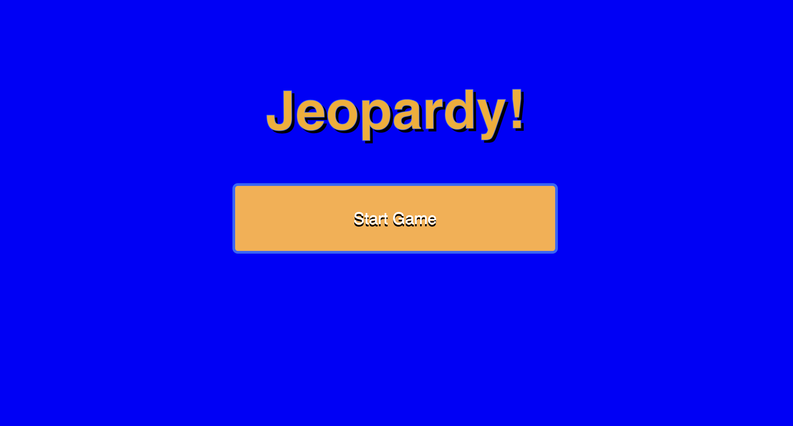
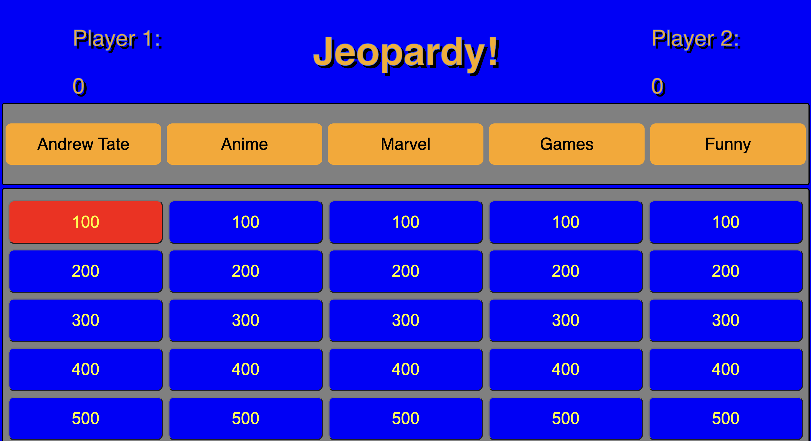

Jeopardy Game!

How to play:
1. Loaded into a home page showing the game logo as well as a button.

2. Click on the 'Start Game' button to enter the actual game itself.
3. Player will be loaded into the game starting as 'Player 1'

4. 'Player 1' will have a choice of 5 categories with 5 questions each.
5. If 'Player 1' gets the answer correct from any category chosen, an audio will play and his turn continues.

6. Question will also be removed as well as the button class and will add a new class.

7. If 'Player 1' gets the answer wrong, an audio will play and the turn will go to 'Player 2'.

8. To win the game, any 'Player' must reach 3000 points but will be reducted to 1000 for demonstration purposes.

9. If any 'Player' wins, an audio will play as well as display the score of the 'Player' with a reset button and a gif.

Difficulties faced:
1. Approach to making the game was not right, had to redo most of the coding due to having unnecessary for loops.
2. Had issues with making the question and answers pop up on the dialog properly.
3. Had an issue with the random question generator which was summing up the index to 0-5 instead of 0-4.
4. This wasn't a difficulty but I didn't have time to add a different class to indicate which player is currently playing.

Technologies used:
1. LocalStorage played a big part in the game since I added the object into it, as well as using slice to remove the questions already answered.
2. Jquery was also used instead of vanilla javascript since it made more sense for DOM manipulation.
3. Used a random question generator with a function that uses Math.random() as well as 2 arguments.
4. Used some audios to make the game more fun and not too plain.

Future improvements:
1. Make the players turn known by adding a class list to the player that changes the css.
2. Changing the design of the website by making it look more modern.